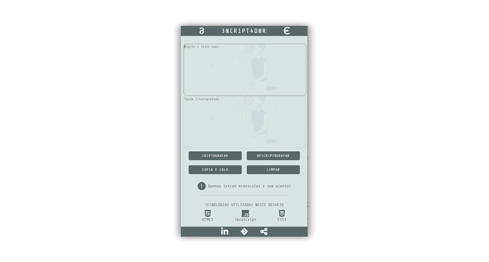

# ENCRIPTADOR

## Projeto Proposto no Programa ONE - Oracle & Alura!

 

 

 

 
 
 
 

 

## A seguir apresento a prévia do projeto.

 

 

## Uma Prévia em dispositivos menores.

 

 

## Uma prévia do sistema em funcionamento

 

 

